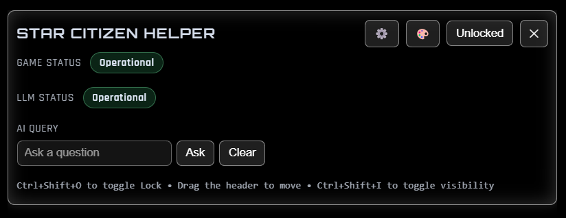
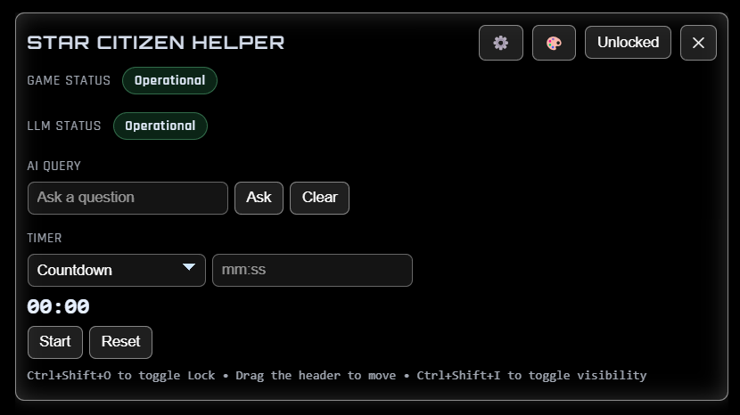
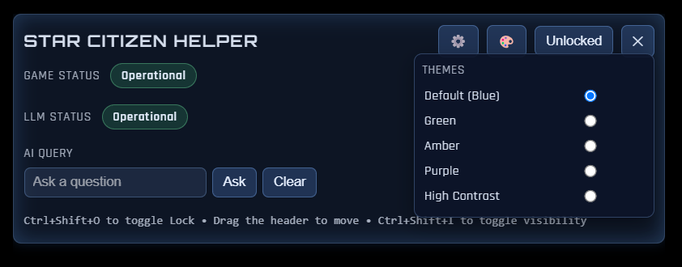

# Star Citizen Helper Overlay

A simple, transparent Electron-based overlay for Star Citizen. It provides quick access to in-game information using Google's Gemini AI and the Star Citizen Wiki, along with at-a-glance status for RSI services.

## Features

- **AI-Powered Answers**: Ask any Star Citizen-related question and get a concise answer from a Gemini-powered AI assistant.
- **Wiki Image Search**: Automatically finds and displays relevant images from the Star Citizen Wiki for topics you search.
- **RSI Status**: Shows the current operational status of Roberts Space Industries services.
- **Customizable Themes**: Choose from several color themes (Default, Green, Amber, Purple, High Contrast) to match your style.
- **Persistent Position**: The overlay remembers its position and size between sessions.
- **Click-Through Lock**: Lock the overlay to pass all mouse clicks through to the game.
- **Configurable UI**: Toggle different panels (Game Status, AI, etc.) to customize what you see.







## Installation

To run this overlay on your local machine, follow these steps:

1.  **Clone the repository:**
    ```bash
    git clone https://github.com/your-username/sc-helper.git
    cd sc-helper
    ```

2.  **Install dependencies:**
    You'll need [Node.js](https://nodejs.org/) installed. Then, run the following command in the project directory:
    ```bash
    npm install
    ```

## Configuration

The overlay uses Google's Gemini API for its AI features. You will need to provide your own API key (Can be obtained for free).

1.  **Get a Gemini API Key:**
    - Go to [Google AI Studio](https://aistudio.google.com/).
    - Sign in with your Google account.
    - Click **"Get API key"** and then **"Create API key in new project"**.
    - Copy your new API key.

2.  **Create the configuration file:**
    - In the root of the project directory, find the `config.example.json` file.
    - Rename it to `config.json`.
    - Open `config.json` and paste your API key into the `GEMINI_API_KEY` field:

    ```json
    {
      "GEMINI_API_KEY": "YOUR_GOOGLE_AI_STUDIO_API_KEY_HERE"
    }
    ```

## Usage

-   **Start the application:**
    ```bash
    npm start
    ```

-   **Keyboard Shortcuts:**
    -   `Ctrl+Shift+I`: Toggle the overlay's visibility.
    -   `Ctrl+Shift+O`: Toggle the click-through lock. When locked, all mouse events pass through to the game.

-   **Controls:**
    -   **Lock Button (🔒):** Toggles click-through mode.
    -   **Theme Button (🎨):** Opens the theme selection menu.
    -   **Settings Button (⚙️):** Opens the settings menu to toggle UI panels.
    -   **Close Button (❌):** Quits the application.

## Install (Windows — Unpacked Release)

If you prefer to run the unpacked build (no installer, no portable wrapper):

1. **Download** the latest release from the Releases page.
2. **Extract** the archive and open the `win-unpacked/` folder (it contains `SC Overlay.exe`).
3. **Configure your API key**:
   - Duplicate or rename `config.example.json` to `config.json` in the same `win-unpacked/` folder.
   - Get a Gemini API key (see the steps in the “Configuration” section above), then open `config.json` and paste your key:

   ```json
   {
     "GEMINI_API_KEY": "YOUR_GOOGLE_AI_STUDIO_API_KEY_HERE"
   }
   ```

4. **Run the app** by launching `SC Overlay.exe` inside `win-unpacked/`.

That’s it—your overlay should start with AI features enabled.
